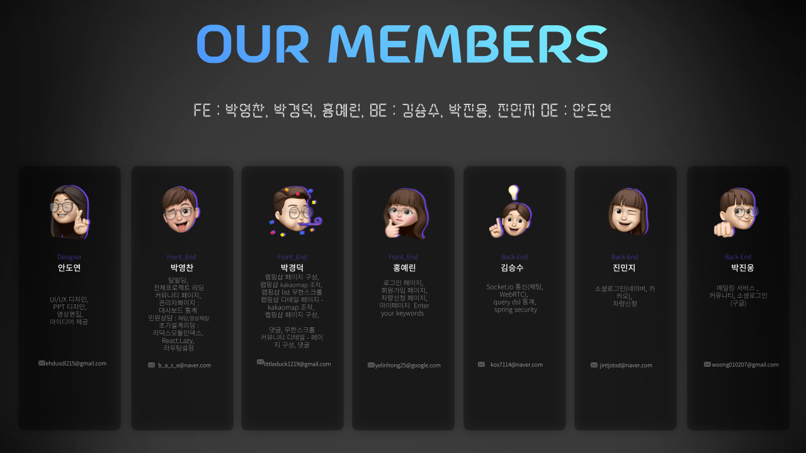

   

# INNO-Motors

  
  

## 프로젝트 소개
- [INNO-Motors](https://innomotors.co.kr) 배포 사이트 살펴보기 
- 간략한소개 : 차량판메 기반 사이트로, 사용자는 차량출고신청과 더불어서 출고차량에 대한 후기 커뮤티니 그리고 자신의 위치기만 인근 랩핑샵 업체와 후기를 통해 차량에 대한 기다림을 누리고, 관리자는 출고신청에 대하여 관리자페이지에서 데이터를 종합적으로 살펴볼 수 있으며 민원상담의 차원에서 채팅과 화상통화까지 구현된 사이트입니다. 

### 만든이
|이름|역할|업무|
|:--|:--|:--|
|박영찬(팀장)|FE| 전체프로젝트 리딩, 커뮤니티 페이지, 관리자페이지(대시보드 통계, 민원상담;채팅,영상채팅), 초기설계(리덕스모듈인덱스, React.Lazy,라우팅설정)|
|박경덕|FE|랩핑샵 페이지 구성, 랩핑샵 kakaomap 조작, 랩핑샵 list 무한스크롤랩핑샵 디테일 페이지 - kakaomap 조작, 랩핑샵 페이지 구성, 댓글, 무한스크롤
커뮤니티 디테일 - 페이지 구성, 댓글|
|홍예린|FE|로그인 페이지, 회원가입 페이지, 차량신청 페이지, 마이페이지 |
|김승수(부팀장)|BE|Socket.io 통신(채팅, WebRTC), query dsl 통계, spring security|
|박진웅|BE|메일링 서비스, 커뮤니티, 소셜로그인(구글)|
|진민지|BE|소셜로그인(네이버, 카카오), 차량신청|
|안도연|DE|UI/UX 디자인, PPT 디자인, 영상편집, 아이디어 제공|

 

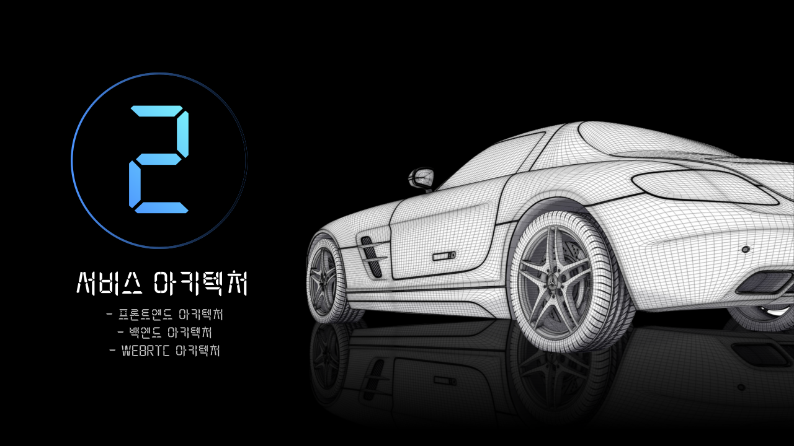
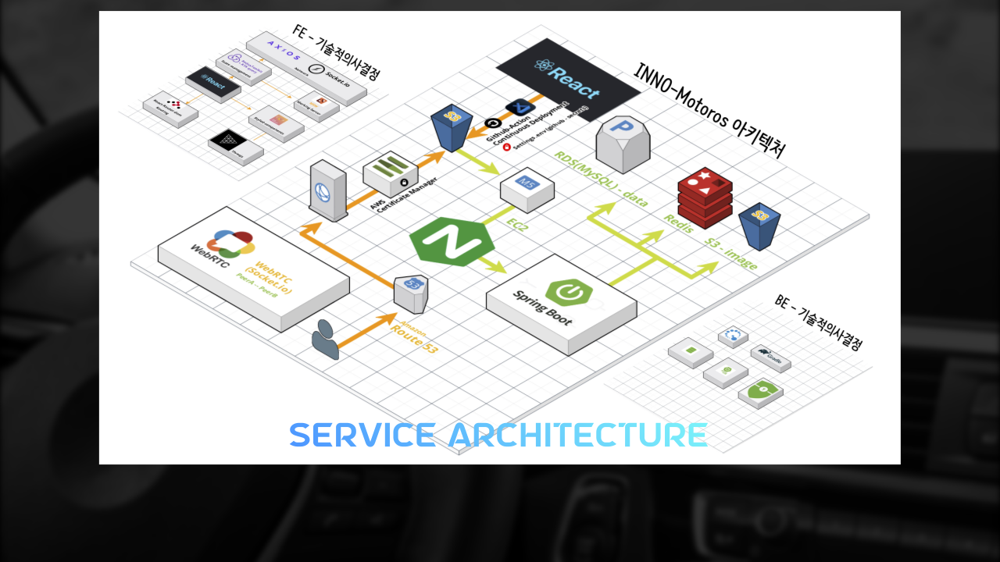

## 프로젝트 기술도입과 의사결정, 도전 및 트러블 슈팅
 

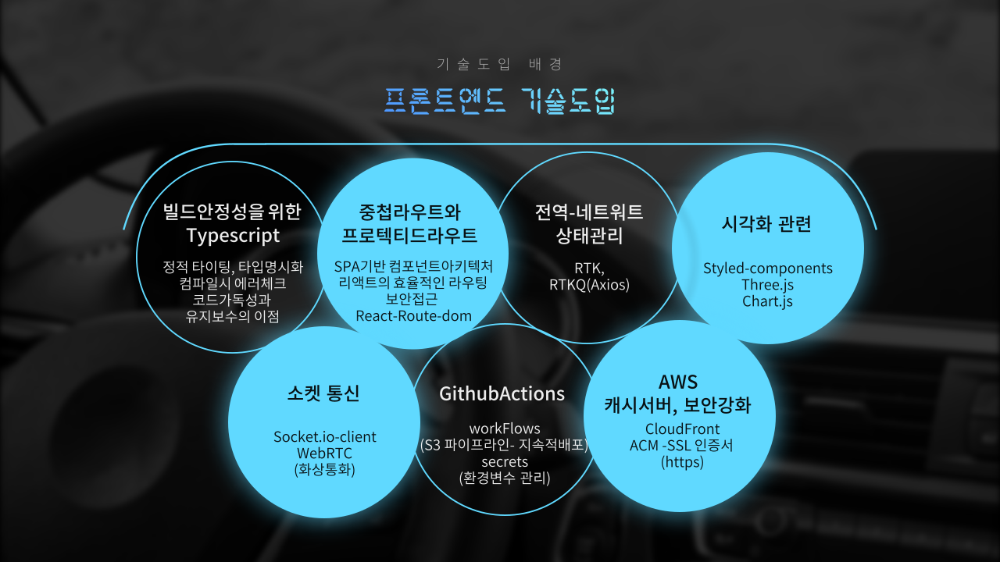
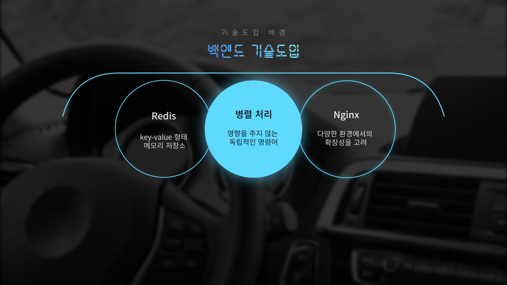

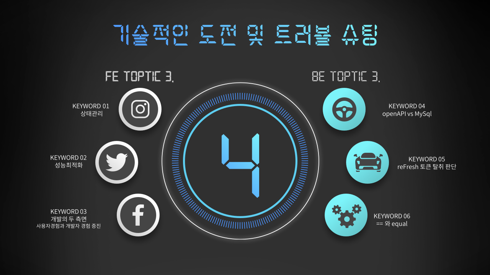 

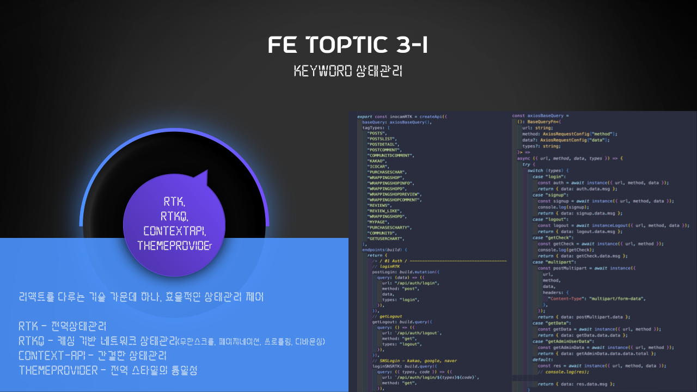
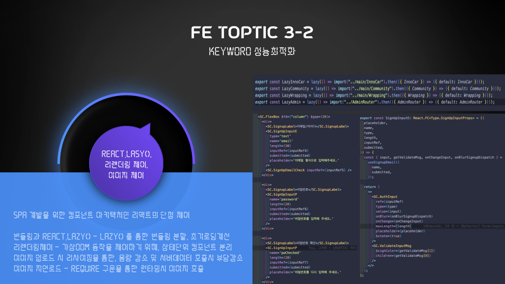

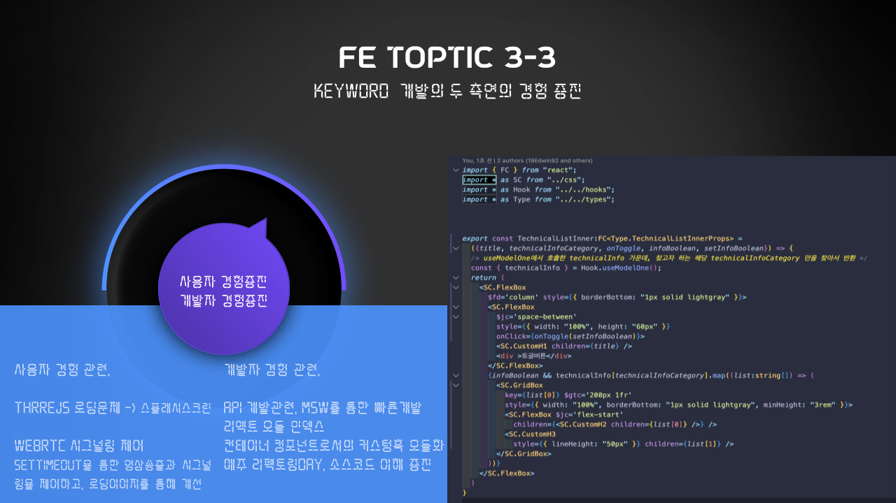
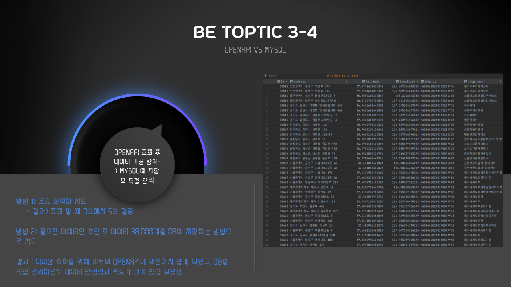

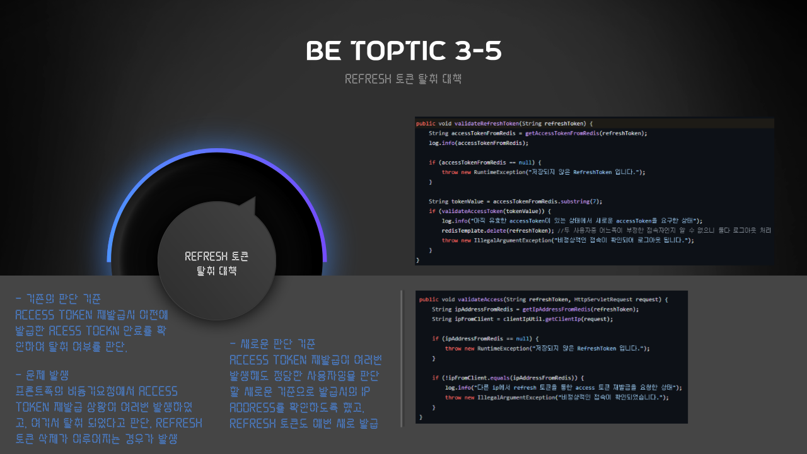
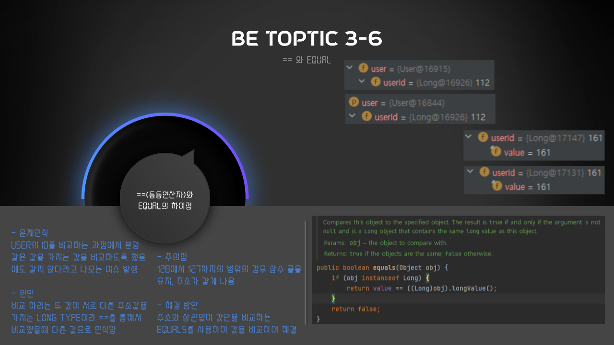

